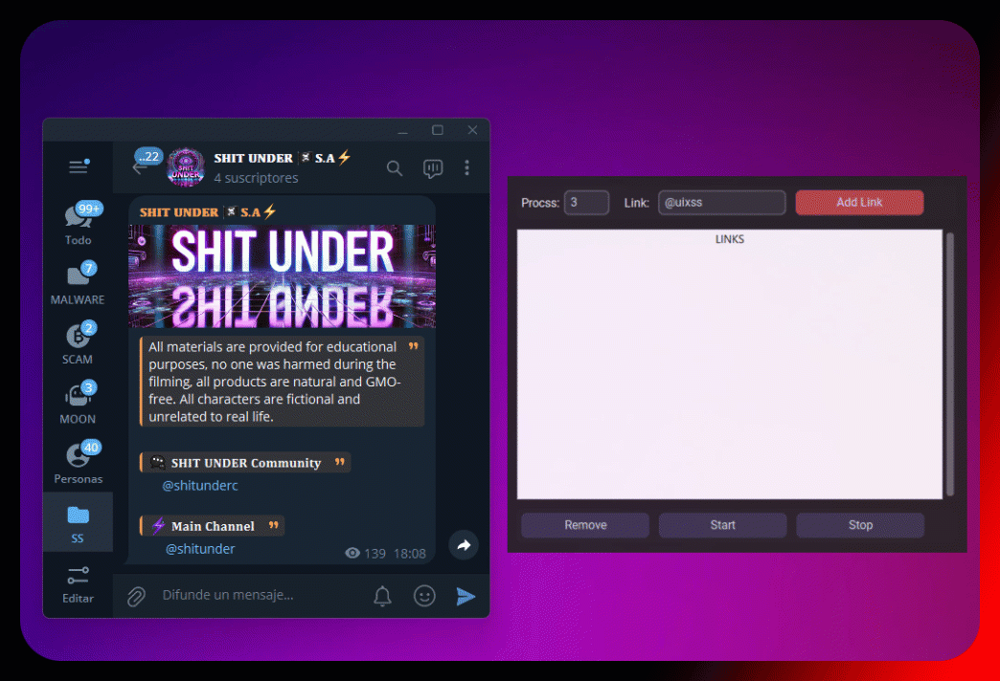

# 🎫 Coding Services SEND DM 🎫

# 📈 UNDERVIEW

This script uses proxies to send "views" to Telegram channel messages in bulk. 🚀

# V2

This script now includes an updated interface and enhanced proxy validation. Only valid proxies are used to send "views" to Telegram channel messages in bulk. 🚀

## 🛠 Requirements

- Python 3.10
  - `requests`
  - `threading`

# 📡 Proxies

The script collects proxies from ProxyScrape for three types of proxies:

    HTTPS
    HTTP
    SOCKS4/5

Contributing
Feel free to submit issues or pull requests to improve the functionality and error handling in these scripts.
